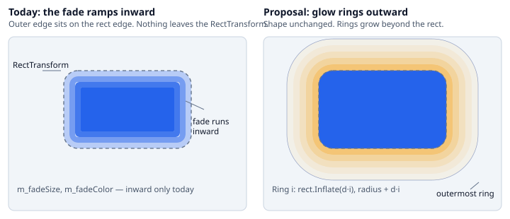
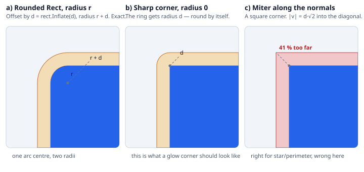
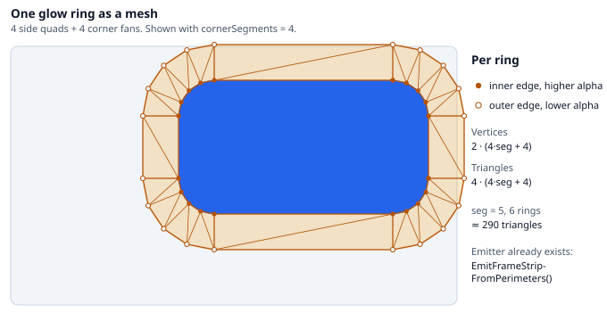
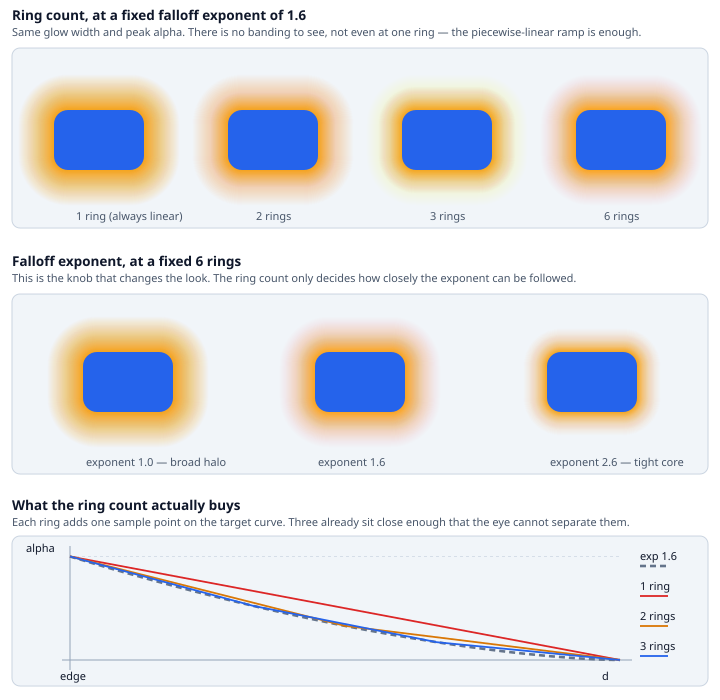
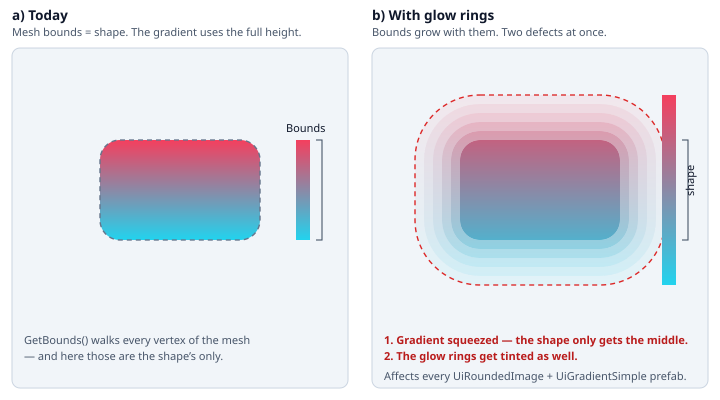
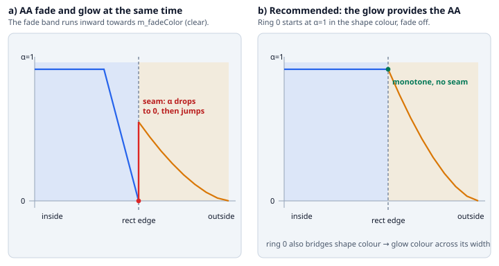

# Outer Glow for UiShapeImage

## Overview

This document outlines how an **outer glow** can be generated as mesh geometry in `UiShapeImage` and its
subclasses, instead of being authored as a bitmap per widget. It is intended as a planning reference, not a
complete specification.

The motivation is practical: a glow is needed constantly, and today it is solved with sprites (as done for the
BOTW chips). A sprite glow is fixed in resolution, cannot be resized without distortion, cannot be tinted at
runtime, and cannot be styled. A generated glow can do all four.

**What this is not:** a performance win. The overdraw area of a ring stack is roughly the same as that of a
bitmap covering the same footprint, and the ring stack costs more vertices. The gain is authoring, not frame
time.

---

## Problem

`UiShapeImage` already fades edges, but only **inward**: every shape puts its outer boundary exactly on the
rect edge and carves the fade band into the interior (see `UiCircle.GenerateFilled`, `UiCircle.GenerateFrame`).
The `Fade` enum's `Inner` / `Outer` refer to the two sides of a *frame* sandwich, not to the outside of the rect.

There is therefore no geometry outside the shape at all, and an outer glow needs exactly that.

---

## What already exists

A large part of the machinery is in place and only needs to be pointed the other way.

| Piece | Location | Reuse |
|---|---|---|
| Ring-to-ring strip emitter with per-edge vertex colours | `UiShapeImage.EmitFrameStripFromPerimeters` | as is |
| Perimeter ping-pong buffers ("current outer" / "next inner") | `UiShapeImage.s_perimA` / `s_perimB` | as is |
| Polygon offset along vertex normals, bisector, miter limit | `UiStar.BuildInsetMiter` | sign flip |
| Uniform-scale offset for convex regular polygons | `UiStar.BuildInsetUniformScale` | as is |
| A colour to fade towards, and a size up to 200 | `m_fadeColor`, `m_fadeSize` | pattern |
| Corner fan / edge quad emitters for the rounded rect | `UiRoundedImage.AddCorner`, `AddEdgeQuad`, `AddQuad` | pattern |

The tooltip on `m_fadeSize` already says *"can also be used for other purposes (e.g. soft shadow)"* — the
intent was there, the direction was not.

---

## Geometry

### The rounded rect needs no normal extrusion

The exact outward offset of a rounded rectangle with corner radius `r` by a distance `d` is a rounded
rectangle with `rect.Inflate(d)` and radius `r + d`. Same arc centres, larger radii. No bisectors, no miter
limit, no self-intersection tests, and it degenerates correctly: at `r = 0` the offset ring has radius `d`,
so a sharp-cornered shape gets a rounded glow corner, which is what a glow should look like. A miter join
would leave a square corner there instead, reaching d·√2 into the diagonal. (On an acute vertex — a star
spike — the same miter really does produce a spike, which is why the miter limit exists.)

Normal extrusion remains the right tool for `UiStar` and any future free-perimeter shape, and there it is
already written — see Phase 5.

### One ring is one frame strip

A ring is structurally identical to what `GenerateFrame` already emits: four side quads and four corner fans.
Only the radii differ.

Per ring: `2 * (4*seg + 4)` vertices and `4 * (4*seg + 4)` triangles. At `cornerSegments = 5` and three rings
that is roughly 145 triangles — irrelevant next to the fill cost.

### The falloff exponent matters, the ring count barely does

Vertex colours interpolate linearly across each band, so the alpha profile is piecewise linear and its slope
jumps at every ring boundary. The expectation was that this shows up as Mach bands. Rendered at the true
per-band interpolation it does not: a one-ring glow is visually indistinguishable from a six-ring one, and
that holds at full peak alpha and down to a narrow 14 px glow, where the pixel gradient is steepest.

What each additional ring buys is one more sample point on the target curve, and three points already sit
close enough that the eye cannot separate them from it. The knob that changes the look is the **falloff
exponent** — with one ring the profile is always linear no matter what the exponent says, which is the only
real argument for going above one.

Consequence for the design: default `m_glowRings` to 3, keep the cap low, and spend the design attention on
the falloff instead.

---

## Phases

### Phase 1 — Outward rings for `UiRoundedImage`

Emit `N` rings outside the shape, ring `i` built from `rect.Inflate(d*(i+1))` with radius `radius + d*(i+1)`,
alpha taken from a falloff over the normalised distance. New serialized fields on `UiShapeImage`:
`m_glowSize`, `m_glowColor`, `m_glowRings` (default 3), `m_glowFalloff`. Gap spans (`m_spanLeft` etc.) must
be resolved per ring or deliberately ignored — a glow around a gapped frame is undefined today.

### Phase 2 — Fix the `UiGradientBase` bounds regression

`UiGradientBase.ModifyMesh` takes the bounds of the **whole** mesh via `UiMeshModifierUtility.GetBounds` and
lerps every vertex. Glow rings enlarge those bounds, so the gradient on the shape is squeezed into the middle
of its range *and* the glow rings get tinted. This changes the appearance of every existing prefab that
combines `UiRoundedImage` with `UiGradientSimple`, so it must be solved before the feature is switched on.

Options: derive the bounds from the shape vertices only, or tag glow vertices and have the modifier skip them.
The second is more general (it also protects future outside-the-rect geometry) and needs a marker channel —
a UV2 flag, or a vertex-range boundary handed to the modifier.

### Phase 3 — Edge handling between AA fade and glow

With the inward fade active, alpha reaches 0 exactly at the rect edge, and the glow starts there at its peak.
That is a discontinuity, and it reads as a thin transparent ring around the shape — worst exactly for subtle
glows, which is the common case.

Recommendation: when the glow is active, suppress the outer fade band and let ring 0 start at alpha 1 in the
**shape's** colour, bridging to the glow colour across its width. The glow then provides the antialiasing and
the profile stays monotone.

### Phase 4 — Style integration

Regenerate the Type-Json for the changed components and press *Write JSON* in the style generator, otherwise
the curated property selection is replaced wholesale. Keep the v1 property set to `Color`, `float` and `int`
only — those are known to round-trip through the style config, style comparison and tweening.

### Phase 5 — Perimeter shapes

`UiCircle` needs a single outward radial ring stack, which is trivial. `UiStar` can reuse `BuildInsetMiter`
with a negative inset, but the sign flip turns the star's notches from convex into concave vertices, where an
outward miter self-intersects. The existing miter limit caps the length but does not prevent the crossing, so
a large glow on a spiky star will fold over itself. Either clamp per-vertex against the neighbouring edge
lengths, or restrict the glow to the uniform-scale strategy for star shapes.

### Phase 6 — Inner glow, documentation, A/B proof

Inner glow is the same ring stack inset instead of outset, and comes almost for free — but it *overlaps* the
fill, so it has to be emitted after it. Then the user-facing paragraph goes into `BEST-PRACTICES.md`, this
document is deleted, and the result is compared side by side against the existing bitmap chip glows to
establish whether it actually replaces them.

---

## Key Decisions (resolve before starting Phase 1)

1. **Blend mode.** Standard UI blending makes a bright glow work on a dark background and nearly vanish on a
   light one. A real glow usually wants additive or screen. Ship normal-only in v1 and add a material variant
   later, or solve it up front (a second material means a second draw call unless it batches)?
2. **Falloff parameterisation.** This is the primary visual control, so it deserves the better answer: a
   float exponent, or a `Gradient` / `AnimationCurve`? A curve is nicer to author, but Unity's `Gradient` has
   no usable value semantics for the style comparison, which is a separate piece of work. A float exponent
   plus a peak alpha covers everything the figure shows.
3. **Inside or outside the rect.** Outside is the natural glow, but `RectMask2D`, `Mask` and `ScrollRect`
   viewports will cut it — a glowing item in a list gets clipped at the viewport edge. Should there be an
   opt-in mode that insets the shape instead, so the glow stays inside the RectTransform?
4. **Ring 0 colour.** Bridge from the shape colour to the glow colour (the Phase 3 recommendation), or glow
   colour throughout with the AA fade left as it is?
5. **Where does `GlowSize` count from** — the shape's outer boundary, or the rect edge? The two differ as soon
   as `m_padding`, `m_useFixedSize` or `m_sizeOffset` are in play.
6. **Should `UiShapeFill` clip the glow?** It operates on the finished mesh, so today it would. Probably
   correct, but it needs a decision and a test.
7. **Glow or shadow.** An offset glow is a drop shadow. Add `m_glowOffset` in v1, or keep it centred and
   revisit later?

---

## Effort Estimate (single developer)

| Phase | Estimate |
|---|---|
| Phase 1 — Outward rings for the rounded rect | 1 PD |
| Phase 2 — `UiGradientBase` bounds fix | 0.5 PD |
| Phase 3 — Edge handling / seam | 0.5 PD |
| Phase 4 — Style integration | 0.5 PD |
| Phase 5 — Circle and star | 1 PD |
| Phase 6 — Inner glow, docs, A/B | 0.5 PD |
| **Total** | **~4 PD** |

Phase 5 carries the widest spread: the concave-vertex clamp for the star is the only genuinely new geometry
problem in the whole feature.

---

## Risk Summary

| Risk | Severity | Mitigation |
|---|---|---|
| `UiGradientBase` bounds change alters existing prefabs | High | Phase 2 before the feature is usable; screenshot A/B over the affected prefabs |
| Seam between fade and glow at low glow alpha | Medium | Phase 3; suppress the outer fade when the glow is active |
| Glow clipped by `RectMask2D` / `ScrollRect` | Medium | Document it; consider the inset mode from Decision 3 |
| Outward miter self-intersects on concave vertices (star) | Medium | Per-vertex clamp, or uniform-scale only for stars |
| Overdraw on mobile with large glows | Low | Same order as the bitmap it replaces; cap `m_glowSize` and warn in the inspector |
| Style config growth for four new properties | Low | Mechanical; keep v1 to Color/float/int |
